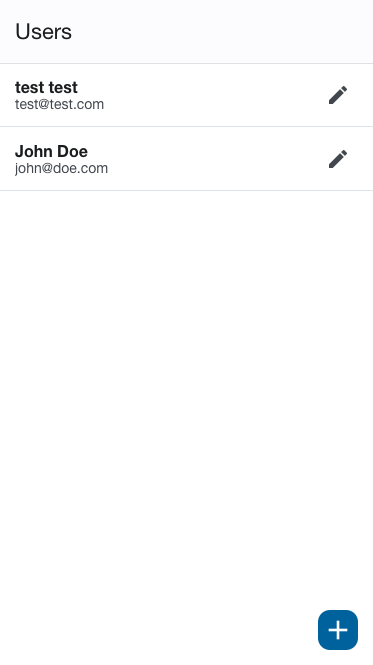

## About

This is a simple CRUD application built with React Native for maintaining users. This project uses a [Hasura](https://www.hasura.io/) GraphQL API to interact with a PostgreSQL database that's hosted on [Heroku](https://www.heroku.com/).



---

## Setup

In order to run this application you need to install [Expo](https://expo.dev/).

## Environment Configuration

You will need to create `AppConfig.tsx` with the following:

```typescript
export const GRAPHQL_URL = '<your_hasura_graphql_url>'
```

## Run

```bash
npm start
```

## Build
```bash
expo build # build appfor botj platforms
expo build:android # build app for android
expo build:ios # build app for ios
expo export:web # export for web
```

## PostgreSQL (Database)

The PostgreSQL database contains only a single schema with one table - `users`.

`users`

| Field      | Type | Optional | PK  |
| -----------|------|----------|-----|
| id         | int  | NO       | YES |
| first_name | text | NO       | NO  |
| last_name  | text | NO       | NO  |
| email      | text | NO       | NO  |

## Credits
Created by [@scarnett](https://github.com/scarnett/)

## License
[](https://opensource.org/licenses/MIT)  
Copyright &copy; 2022 Scott Carnett. Licensed under the MIT License (MIT)
